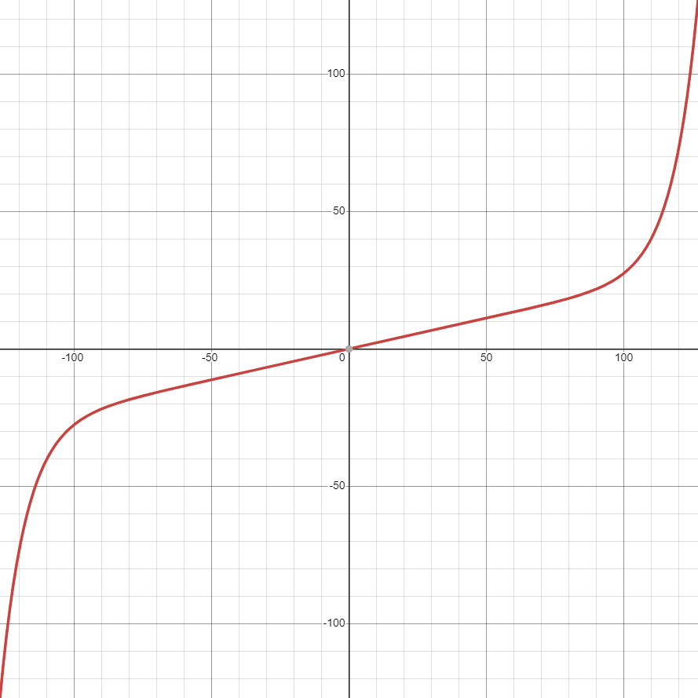

# Driver Control
The key design philosophy behind the button mapping is to keep the driver's thumbs on the joysticks whenever possible. This means that often used functionality must be accessible without moving the driver's thumbs and thus these functions are mapped to the trigger buttons. We also must reduce the likelihood of the driver accidentally pressing buttons that could be detrimental, such as the emergency stops, and thus these function require that two buttons be pressed.

### Control Scheme
Before we can look at the code, we must first set out the requirements for the code:
- Left Joystick vertical axis => left side of the drive (tank drive)
- Right Joystick vertical axis => right side of the drive (tank drive)
- UP => move lift up slowly
- DOWN => move lift down slowly
- UP double press => move lift to highest position
- DOWN double press => move lift to lowest position
- R1 => Toggle Wings 
- R2 => Toggle Blocker
- L1 => Intake
- L2 => Outtake
- RIGHT => Toggle automatic firing functionality of the catapult
- LEFT => manually fire catapult
- X & A => toggle catapult emergency stop
- Y & B => toggle lift emergency stop
### Terms
- Boolean: A value that can only be true or false
- Rising Edge:
  Often times you only want to do an action once per button press, such as a toggle. One way to approach this is to do this action when the button changes from false to true. This kind of boolean transition is called the rising edge.
- Falling Edge: The transition from true to false.
### Code
now let's look at some code:
- Tank drive:
  ```cpp
    // takes each side's drive power in the range [-127, 127] and a curve gain
    Robot::chassis->tank(
        // gets left joystick y axis in the range [-127, 127]
        Robot::control.get_analog(pros::E_CONTROLLER_ANALOG_LEFT_Y),
        // gets left joystick y axis in the range [-127, 127]
        Robot::control.get_analog(pros::E_CONTROLLER_ANALOG_RIGHT_Y),
        // drive curve gain to enable greater control of the robot.
        15);
  ```
  Ok, but whats this "drive curve"? The idea is to make it easier to control the robot at slow speeds, but still be able to go at max speed. This enhances our driver's ability to accurately control the robot. In this graph the x is the vertical axis of the joystick, and the y is the output voltage (this specific curve is the work of team 5225A *The Pilons*):
  <p align="center">
  <a href="https://www.desmos.com/calculator/rcfjjg83zx"> 
    
  </a>
  </p>
- Lift: 
  The lift must be capable of moving from its topmost position to its lowest position as quickly as possible, but sometimes its also beneficial to have the lift somewhere in the middle. This is useful for minimizing the chance of tipping when blocking or shooting. We do this by moving the lift to its max or min with a double press, but the driver may also just press up or down to move the intake to a middle position.

  How do you detect a double press? A double press boils down to a button being pressed twice with little delay between the two presses. That begs the question of what is a press? You can either listen to the falling edge or the rising edge of the button to detect a button press. We use the falling edge for the first press and rising edge for the second press.

  This double press algorithm looks like so:
    - On falling edge of button, record the current time and store it in  a variable
    - On the rising edge of a button, find how long it has been since the last button press. If it has been less than 150 ms, then go to the min / max of the lift.
    - Always perform the normal functionality of the button no matter whether the button is being double pressed or not
      > [!WARNING]
      > For our lift, we can let this happen, because moving the lift up when its target is at its max position, because we prevent it from going above the max angle of the lift.
      > But, when using double presses for different subsystems this may cause problems unwanted behavior.
  ```cpp
  const bool up = Robot::control.get_digital(pros::E_CONTROLLER_DIGITAL_UP);
    const bool down =
        Robot::control.get_digital(pros::E_CONTROLLER_DIGITAL_DOWN);

    // lift granular control
    // change the goal position of the lift by the liftIncrement
    Robot::Subsystems::lift->changeTarget(
        liftIncrement *
        (up - down) // ensures that if up and down are both pressed, then nothing happens
    );

    // lift max/min angle
    // on the rising edge of up, if up was pressed recently,
    // then set target to max angle
    if (up && !prevUp &&
        pros::millis() - lastUpPress < maxTimeBetweenDoublePress)
      Robot::Subsystems::lift->setTarget(LiftArmStateMachine::maxAngle);
    // on the rising edge of down, if down was pressed recently,
    // then set target to max angle
    if (down && !prevDown &&
        pros::millis() - lastDownPress < maxTimeBetweenDoublePress)
      Robot::Subsystems::lift->setTarget(LiftArmStateMachine::minAngle);

    // on falling edge of up & down, update the last press time
    if (!up && prevUp) lastUpPress = pros::millis();
    if (!down && prevDown) lastDownPress = pros::millis();

    // update previous values of up and down
    prevUp = up;
    prevDown = down;
  ```
- Toggles: Wings / Blocker / Automatic Catapult firing
    ```cpp
    // wings toggle
    // retrieve the value of the R2 button
    const bool r1 = Robot::control.get_digital(pros::E_CONTROLLER_DIGITAL_R1);
    // if on the rising edge of the button
    if (r1 && !prevR1) {
      // flip the state of the wings
      wingsState = !wingsState;
      // apply the state of the wings to the actual pistons
      if (wingsState) Robot::Actions::expandWings();
      else Robot::Actions::retractWings();
    }
    // update the previous value of R1
    prevR1 = r1;
    // the other toggles are implemented in much the same way
  ```
- Intake / Outtake
  ```cpp
    // if pressing L1, then spin the intake inwards
    if (Robot::control.get_digital(pros::E_CONTROLLER_DIGITAL_L1))
      Robot::Motors::intake.move(127);
    // if pressing L2, then spin the intake outwards
    else if (Robot::control.get_digital(pros::E_CONTROLLER_DIGITAL_L2))
      Robot::Motors::intake.move(-127);
    // otherwise, don't sent power to the intake
    else Robot::Motors::intake.move(0);
  ```
- Catapult/Lift emergency stop toggle
  ```cpp
    // get whether both emergency stop buttons are currently being pressed
    const bool cataEStopCombo =
        Robot::control.get_digital(pros::E_CONTROLLER_DIGITAL_X) &&
        Robot::control.get_digital(pros::E_CONTROLLER_DIGITAL_A);
    // if both buttons have just become pressed (rising edge), then toggle the
    // emergency stop of the catapult
    if (cataEStopCombo && !prevCataEStopCombo) {
      // if the catapult is currently emergency stopped, then disable the
      // emergency stop
      if (Robot::Subsystems::catapult->getState() ==
          CatapultStateMachine::STATE::EMERGENCY_STOPPED)
        Robot::Subsystems::catapult->cancelEmergencyStop();
      // otherwise emergency stop the catapult
      else Robot::Subsystems::catapult->emergencyStop();
    }
    // update the previous value of the emergency stop buttons
    prevCataEStopCombo = cataEStopCombo;
  ```
